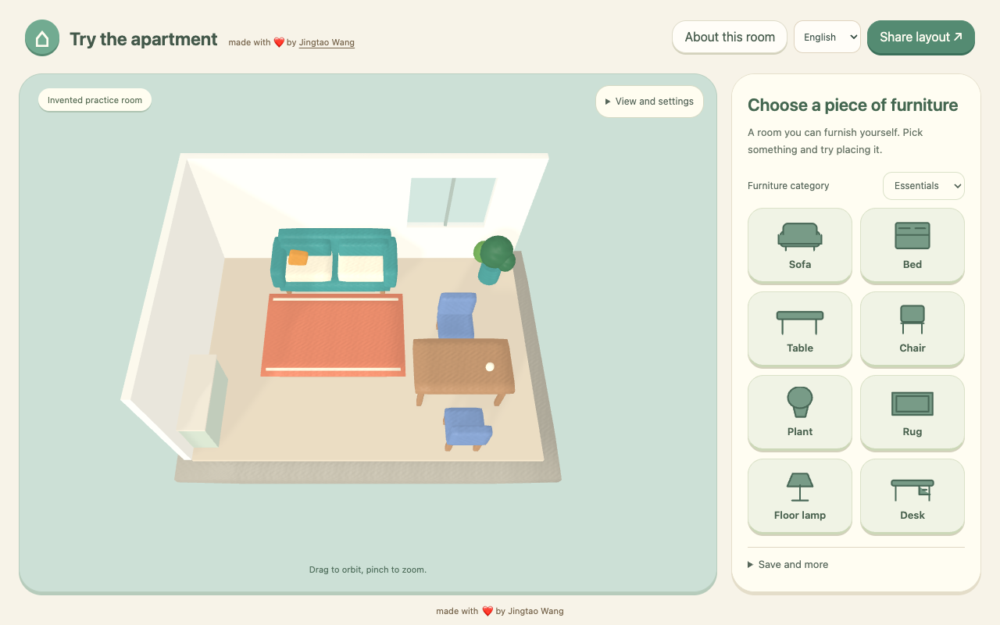

# Move

**Turn room videos into explorable 3D models with your coding agent.**

[Download the skill ZIP](https://github.com/jt-wang/move-room-playground/releases/latest/download/blender-room-tour.zip) · [Agent setup guide](https://move.jingtao.io/setup.md)

## Install the skill

```sh
npx skills add jt-wang/move-room-playground --skill blender-room-tour
```

Works with Claude Code and Codex. For manual installation, download and copy the whole [`skills/blender-room-tour/`](skills/blender-room-tour/SKILL.md) folder into your project (`.claude/skills/` for Claude Code, `.agents/skills/` for Codex). [Setup](skills/blender-room-tour/reference.md#requirements).

Then ask your agent:

> Use blender-room-tour to turn this apartment video into an editable 3D model I can explore.

Your agent reviews the footage, builds in Blender, and checks the model against the video. The geometry is estimated from the footage, not a measured scan.

## See what I built

I had no 3D modeling background. I built Move so I could revisit and compare the apartments I’d filmed. This skill is the reusable workflow behind it.

**[Try Move →](https://move.jingtao.io)**



## Build and preview locally

```sh
npm ci && npm run build      # the playground, bundled into release-public/
npm run build:site           # learner site in site-dist/; needs the inputs in docs/SITE-RELEASE.md
npm run serve:site           # http://127.0.0.1:PORT/ ; the playground is at /play/
```

This repository holds code and one invented practice room. The story film and hero image are supplied separately at site build time.

[Development](docs/DEVELOPING.md) · [Site and release](docs/SITE-RELEASE.md) · [Assets](docs/ASSETS.md) · [MIT](LICENSE)

By [Jingtao Wang](https://jingtao.io).
